## Introduction

For this group project we built a Shopify mini-store prototype for CPP Farm Store, called Cal Poly Pomona Farm Store online. The prototype demonstrates how the Farm Store's products could be organized and presented in an ecommerce environment that supports both online browsing and the in-person visit to the physical store at Kellogg Ranch.

The purpose of our prototype is threefold: online product browsing, gift bundle merchandising, and supporting the online-to-offline journey where customers discover products online and pick them up or visit in person.

::: callout-note
This is a prototype built for course purposes. It does not process real payments, collect real customer data, or represent CPP Farm Store publicly.
:::

## Store Overview and Product Selection

Rather than reproducing the Farm Store's entire inventory, we selected a small but meaningful set of product categories, summarized in @tbl-categories.

| Category | Examples | Role in the store |
|------------------|--------------------------|----------------------------|
| Featured Products | Farm fresh eggs, milk, vanilla ice cream, avocados, honey, orange juice | Everyday staples that anchor repeat visits |
| Fresh Produce | Strawberries, Fuji and Granny Smith apples, CPP-grown navel and mandarin oranges, potatoes, onions, artichokes | The core of what the farm actually grows, including CPP-branded citrus |
| Gift Baskets | Breakfast Box, Anti Pasti Box, Christmas Basket, Fruit and Snacks Box, Pasta Box, Sweet Box | Higher-margin gifting occasions and the farm-to-table story |
| Seasonal | Seasonal specials and promotions, up to 30 percent off | Time-limited offers that give customers a reason to come back |

: Product categories in the mini-store prototype {#tbl-categories}

The screenshots below show the Fresh Produce assortment in the Shopify admin and on the customer-facing collection page.

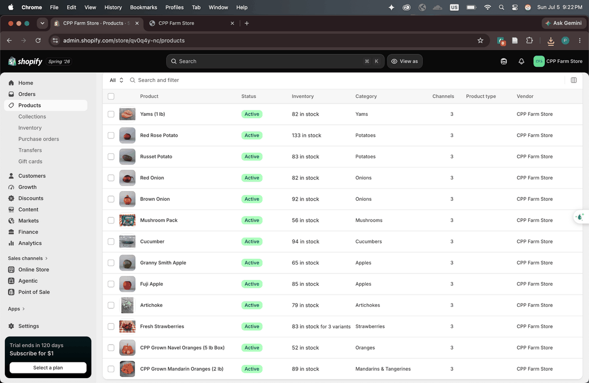

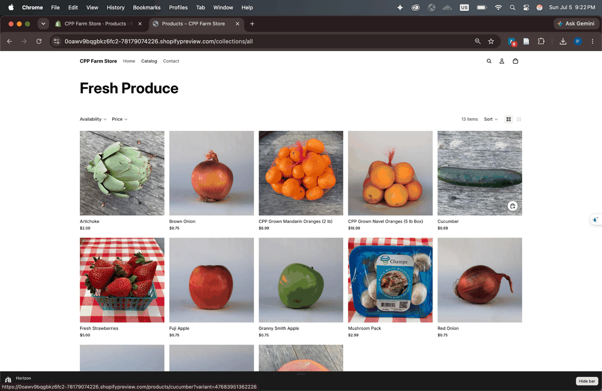

## Homepage

The homepage communicates what CPP Farm Store offers, why customers should care, and where to go next. It opens with a photo of the actual red barn storefront and the message "Fresh products from CPP farm," followed by a Featured Products section, banner links into the Fresh CPP Produce and Gift Baskets collections, two value proposition panels, and a visit section with address and hours.

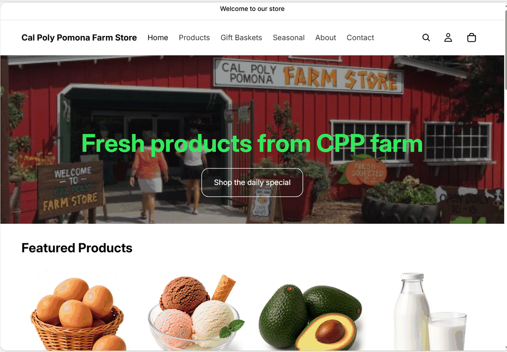

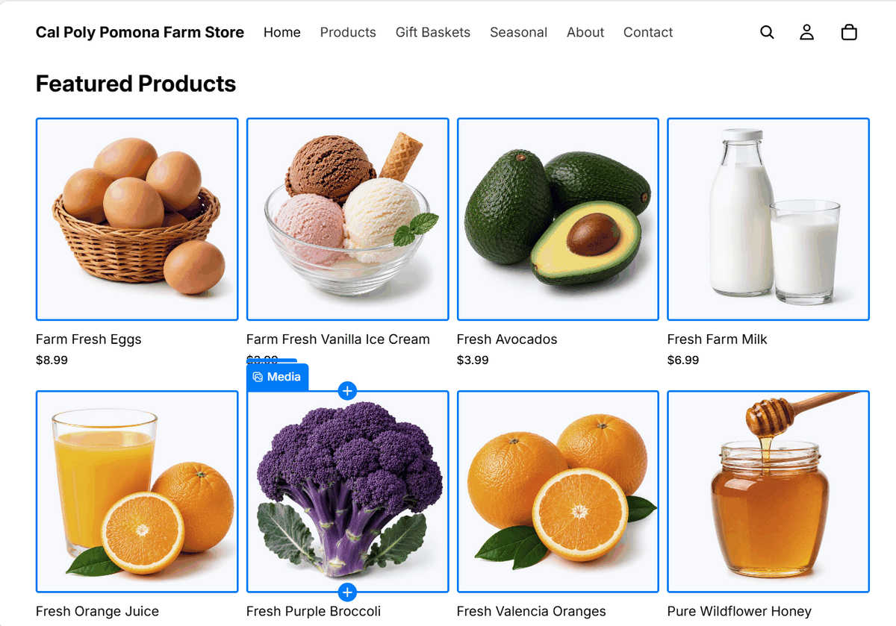

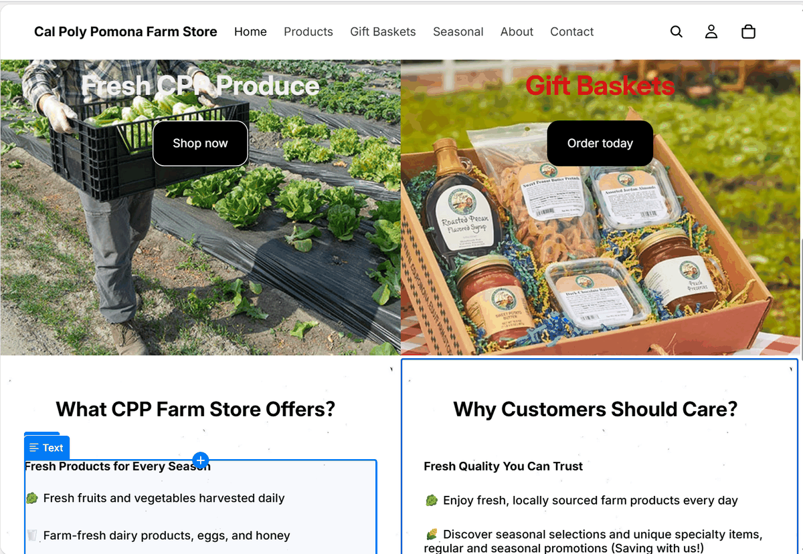

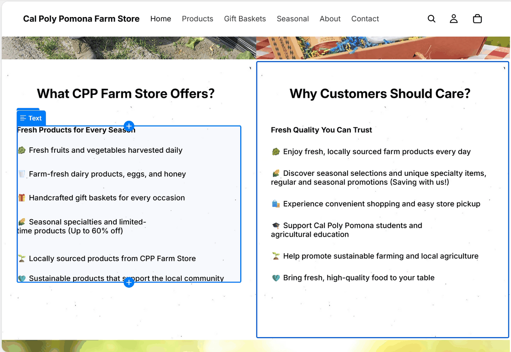

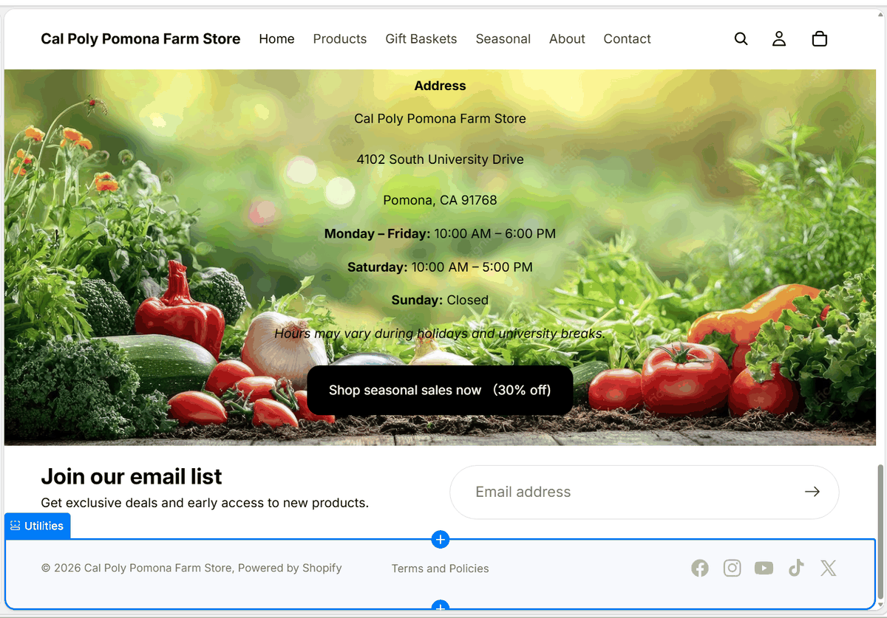

The homepage includes several calls to action: Shop the daily special in the hero, Shop now and Order today on the collection banners, Shop seasonal sales now (30 percent off) in the visit section, and an email list signup in the footer.

## Navigation

The main menu keeps browsing simple with six destinations: Home, Products, Gift Baskets, Seasonal, About, and Contact. Search, account, and cart icons sit in the standard top-right position.

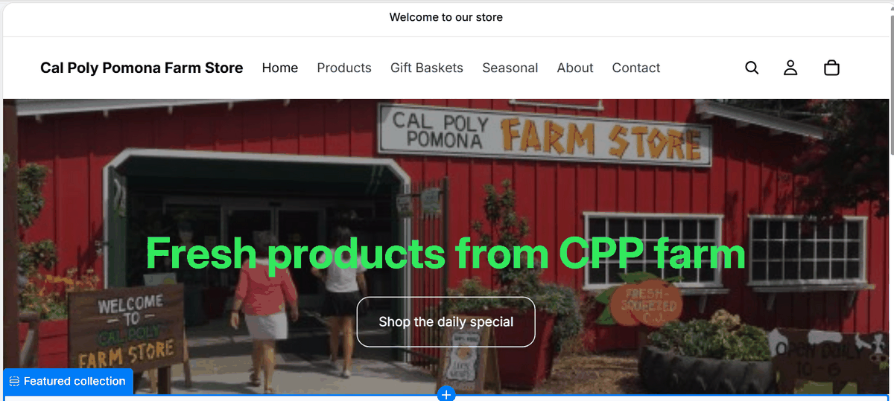

The structure follows how customers actually shop rather than how the farm is organized internally. A produce shopper goes to Products, a gift buyer goes straight to Gift Baskets, a deal seeker checks Seasonal, and a first-time visitor finds the story and the practical details under About and Contact.

## Product and Collection Examples

The assignment requires at least five product or collection examples. We include six.[^1]

[^1]: All prices shown are prototype prices for demonstration, not actual CPP Farm Store pricing.

::: panel-tabset
### Featured Products collection

Everyday farm staples: eggs (\$8.99), vanilla ice cream (\$3.99), avocados (\$3.99), farm milk (\$6.99), orange juice (\$7.99), purple broccoli (\$6.99), Valencia oranges (\$4.99), and wildflower honey (\$9.99). In the admin, each product carries a category, product type (Fresh Agricultural Products), vendor, and inventory count.

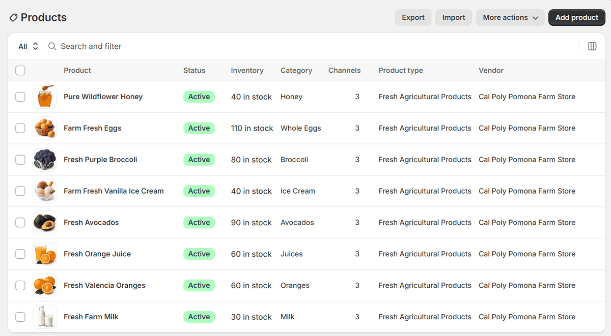

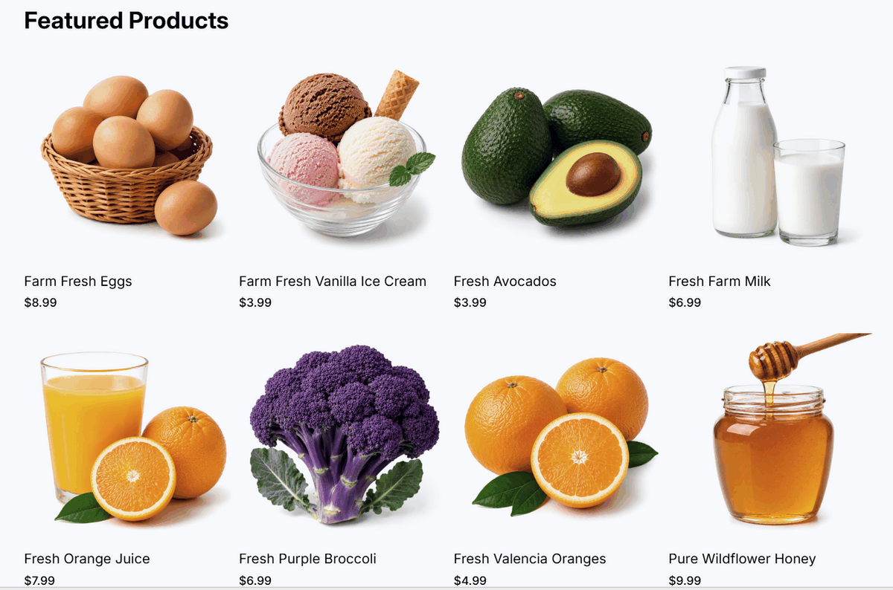

### Fresh Produce collection

Thirteen items covering what the farm grows, from strawberries and apples to potatoes, onions, and artichokes, including CPP-branded items like CPP Grown Navel Oranges (5 lb box) and CPP Grown Mandarin Oranges (2 lb).

### Gift Baskets collection

Six themed baskets at a \$50 price point: Breakfast Box, Anti Pasti Box, Christmas Basket, Fruit and Snacks Box, Pasta Box, and Sweet Box. The collection has its own homepage banner, "Made with Care, From Our Farm to Yours," with trust badges for locally grown, thoughtful gifts, shipping availability, and student agriculture support.

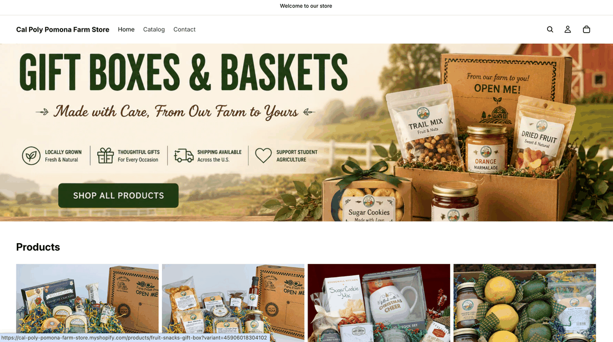

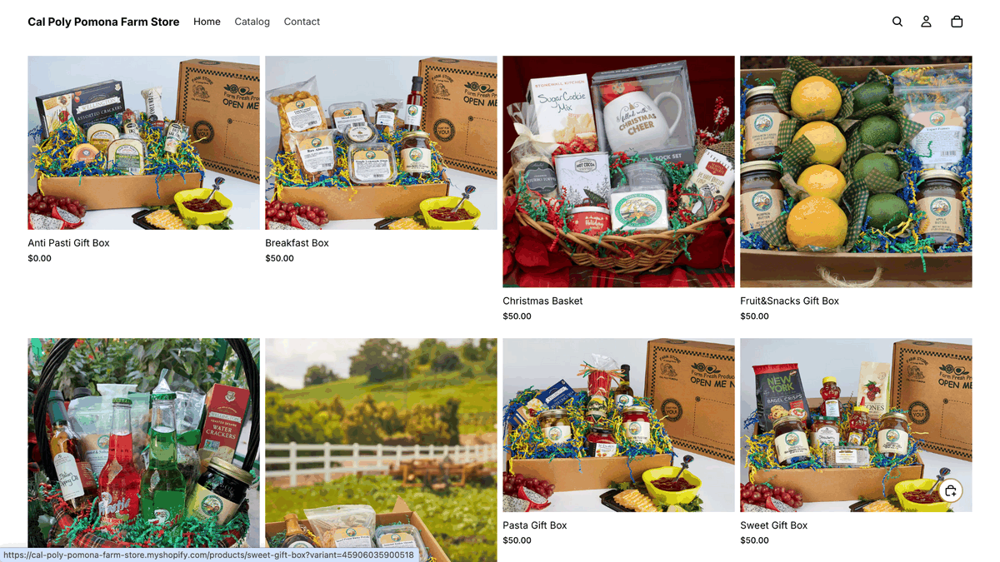

### Fresh Strawberries product page

The strawberry product page shows the elements every product page in the store follows: title, price, real product photos, size variants (1 lb, 1/2 flat, flat), quantity selector, Add to cart and Buy it now buttons, a customer-oriented description, and a You may also like section for cross-selling.

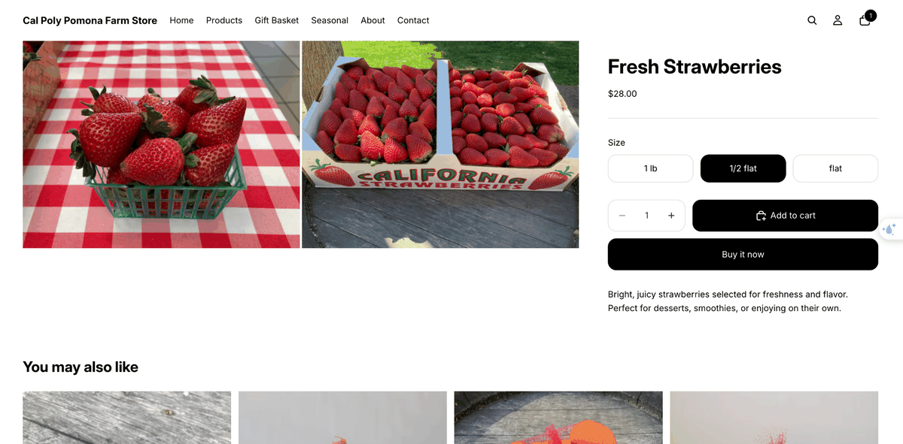

### Seasonal promotion

Seasonal offers appear in two places: a dedicated Seasonal menu item and a Shop seasonal sales now (30 percent off) call to action in the homepage visit section, giving returning customers a reason to check back.

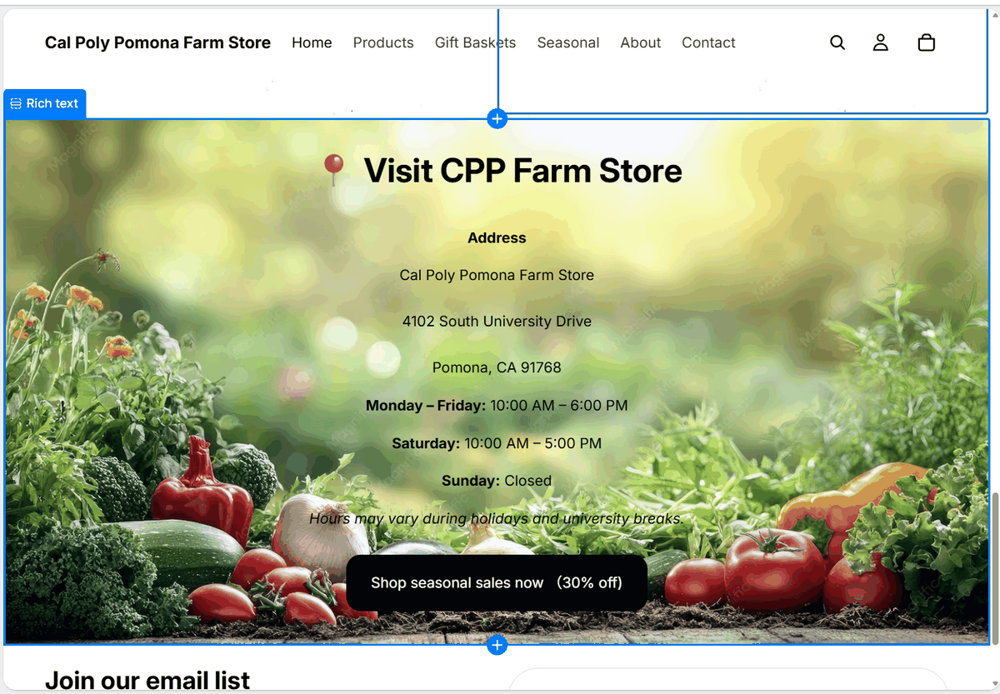

### Contact and trust information

The Contact page carries the practical information customers need before visiting: the Kellogg Ranch address, daily hours, holiday closures, staff contacts for the Farm Store, nursery, field trips, and petting farm, and accepted payment methods including Bronco Bucks and Meal Points.

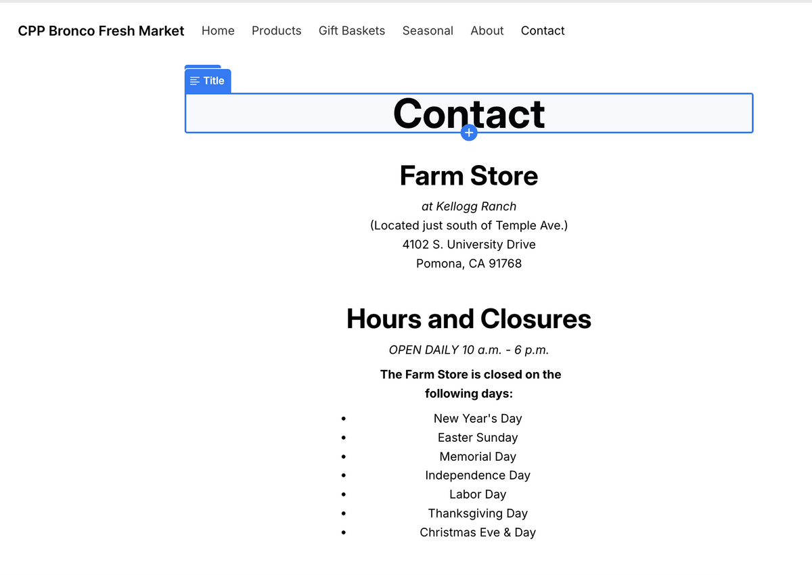

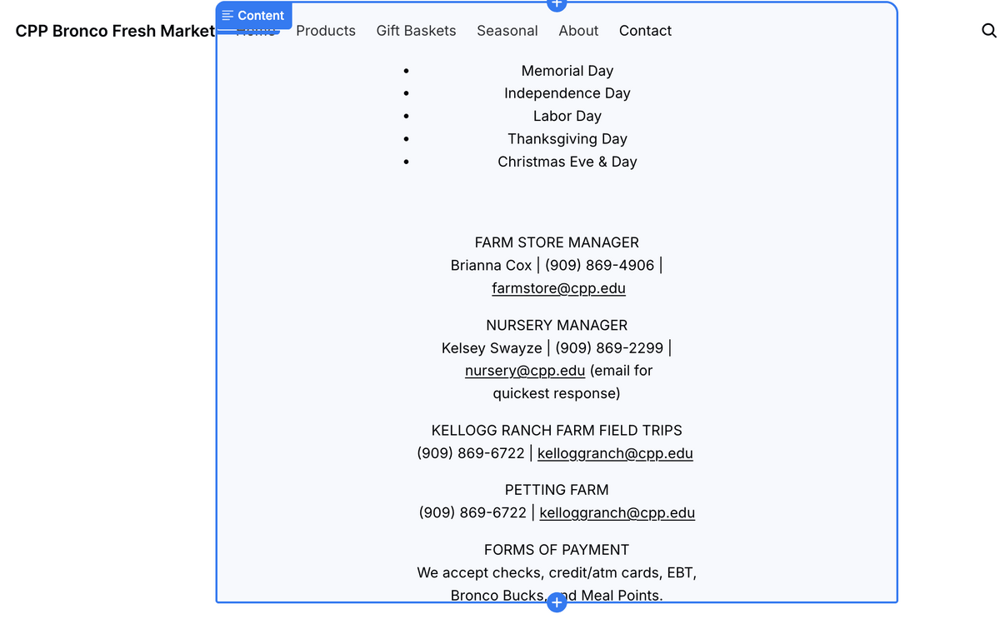
:::

## Target Customer

The prototype serves three overlapping customer groups. The primary group is local families and community members within driving distance of campus who value fresh, locally grown food and already know the red barn. For them the site works as a planning tool: check what is in season, see hours, and decide when to visit. The second group is the campus community, students, faculty, and staff, who shop casually and respond to student-friendly price points and the fact that the store accepts Bronco Bucks and Meal Points. The third group is gift buyers, including alumni and holiday shoppers, who may never visit in person but want a Cal Poly Pomona branded gift shipped or picked up. The Gift Baskets line, with shipping availability called out on the banner, exists specifically for them.

## Ecommerce Strategy

Our strategy is discovery online, fulfillment flexible, story everywhere.

Discovery online means the site's first job is helping people find and browse products, not maximizing online checkout. Most Farm Store revenue realistically happens at the register, so the homepage prioritizes featured collections, seasonal offers, and visit information over aggressive checkout prompts.

Fulfillment flexible means the store supports more than one way to buy. Fresh produce leans toward in-store visits supported by online browsing, while gift baskets support shipping, which extends the store's reach to alumni and gift buyers who will never drive to Pomona.

Story everywhere means the student agriculture story is treated as the store's main differentiator. Any grocery store sells eggs and oranges; only CPP Farm Store sells eggs and oranges grown through a student agricultural program. That story appears on the gift banner ("Support Student Agriculture"), in the value proposition panels, and in the About and Contact pages, because it is the reason to choose this store over a supermarket.

Pricing supports the strategy with simple, mostly round price points (\$3.99 to \$9.99 staples, \$50 gift baskets) and seasonal discounts up to 30 percent to create urgency and repeat visits.

## Connection to the Omnichannel Journey

The prototype addresses the friction points identified in our omnichannel journey map from GP1.

Discovery friction: customers previously had no easy way to know what the Farm Store carries without visiting. The Featured Products section, browsable collections, and product pages with real photos solve this at the awareness and consideration stages.

Visit planning friction: hours and location were scattered. The homepage visit section and the Contact page put address, daily hours, and holiday closures one click away, supporting the transition from online interest to an in-person trip.

Seasonal awareness friction: the farm's inventory changes with the seasons, but customers had no reminder mechanism. The Seasonal menu item, the 30 percent off banner, and the email list signup give the store both a pull channel (check the seasonal page) and a push channel (email) for time-sensitive products.

Gift buyer friction: gift buyers need convenience more than freshness inspection. Pre-assembled \$50 baskets with shipping availability let this segment complete the entire journey online, the one path where the prototype supports a fully digital purchase.

Together these connect the online touchpoint to the physical store rather than replacing it: the website handles discovery, planning, and reminders, while the red barn stays the heart of the experience.

## Appendix

Shopify store (preview): *\[insert Shopify store or preview URL here\]*

GitHub Repository: *\[insert GitHub repo URL here\]*

GitHub Pages (Published Report): *\[insert GitHub Pages URL here\]*
